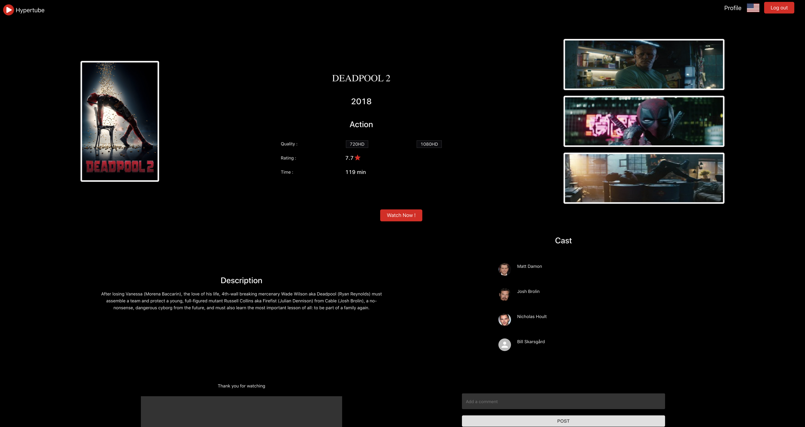
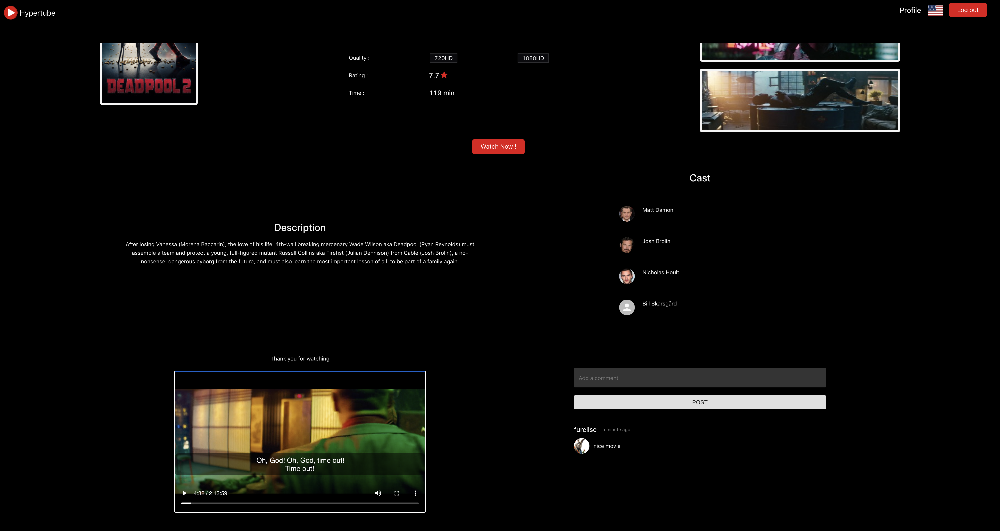
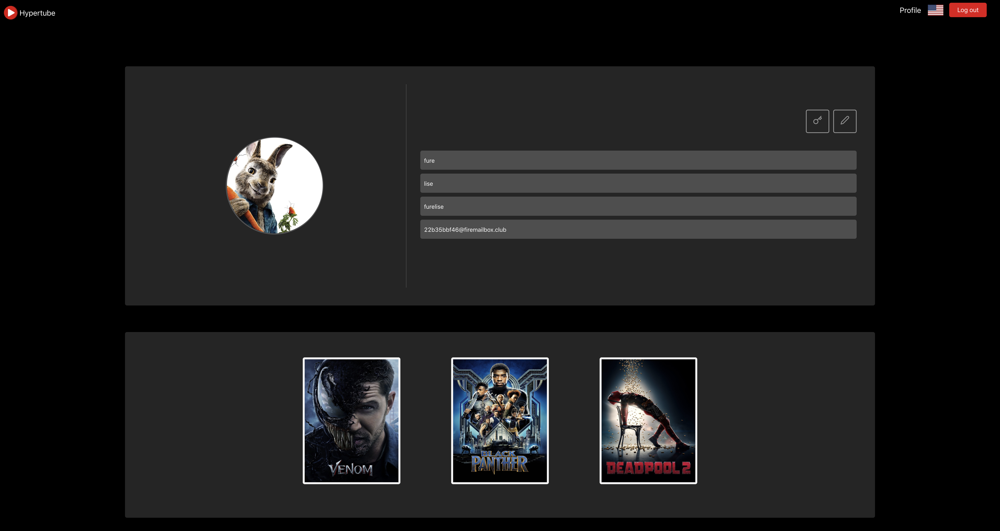
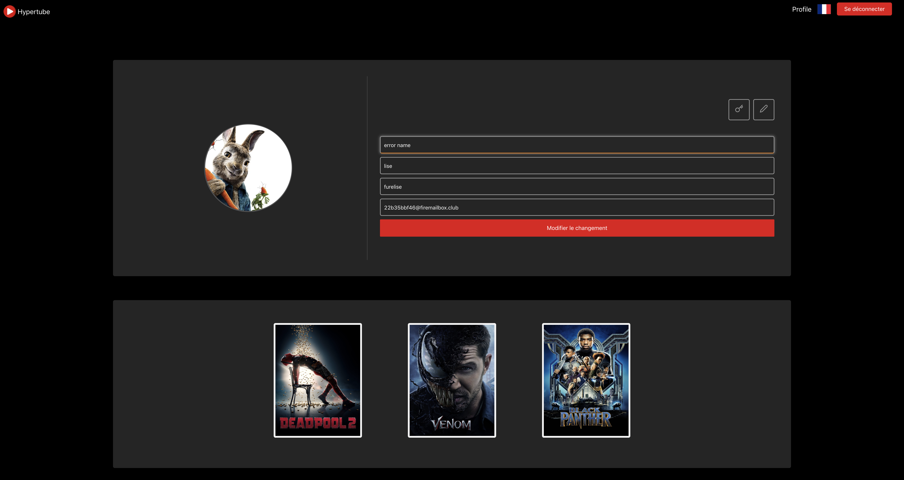
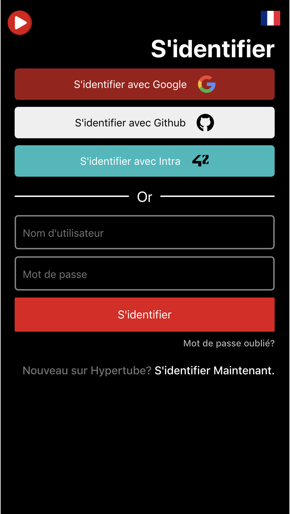
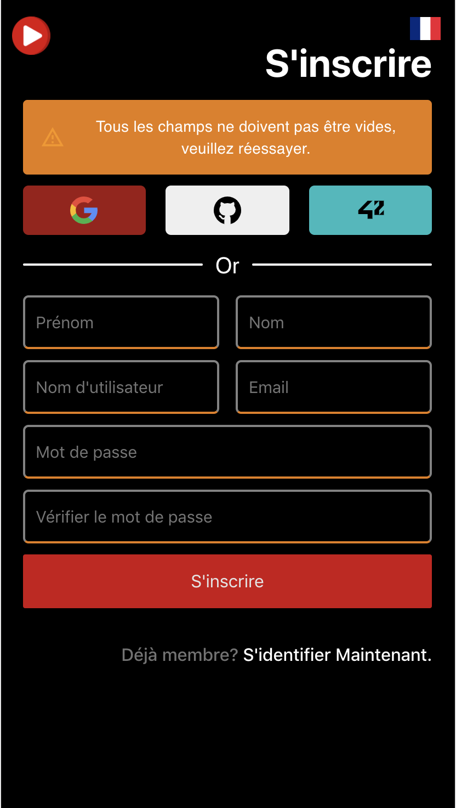
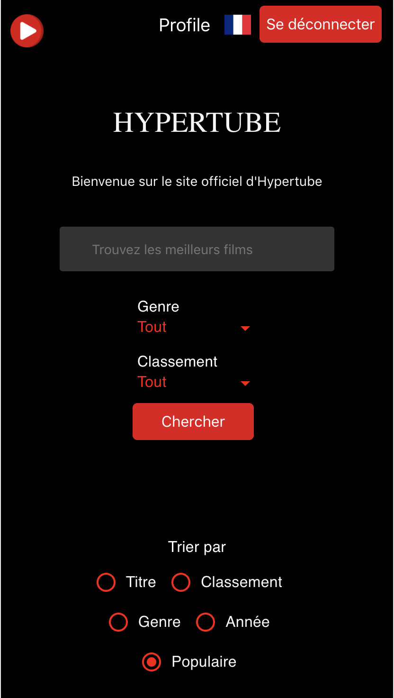
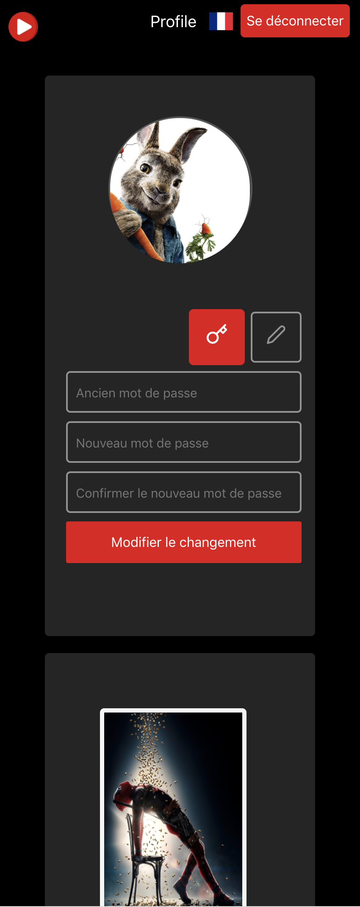

                                🍿 🍿 WELCOME TO OUR LOCAL VERSION OF Netflix 🍿 🍿
                         
<hr>

> # HYPERTUBE 🎥
Hypertube is a torrent downloading/streaming web app that allows users to research and watch videos with the best UX possible.

<hr>

> # Description
After creating an account, either by the normal way or via Oauth with the following websites:
- 42
- Google
- Github

Users can watch movies with several qualities and subtitles, with search and filter feature. They can also comment in the movie page. The movie page contains also screen Shot of the movie.
Users can also see the movies they have already watched.

<hr>

> # Back-end
- Node.js
- Express.js
- MYSQL

<hr>

> # Front-end
- React.js (+hooks)
- Material-ui

<hr>

> ## Getting Started

These instructions will get you a copy of the project up and running on your local machine

<hr>

> ### How to run it ?

   1. cd client && npm install

   2. cd server && npm install

   3. cd server && nodemon start

   4. cd client && npm run Product

   5. Open browser and go to `http://localhost:3000`
   
   6. Enjoy!

<hr>


> # Created By : 
-  ZOUGGAR Khaoula
-  HALOUA Ali
-  AZEROUAL Abdellah 
-  RAFI Hamza

<hr>

># Screenshots 🎞

# Full Screen
 ```
 Home
 ```

 ```
Login
 ```

 ```
 Register
  ```

  ```
 Forget Password
  ```

  ```
 Confirm
  ```

  ```
 Reset Password
 ```

 ```
Search
 ```

 ```
Library
 ```

 ```
Movie
 ```

  ```
 Movie Stream
 ```

  ```
 Profile
 ```

 ```
Edit
 ```


# Responsive
 ```
 Home
 ```

  ```
 Login
 ```

  ```
 Register
 ```

  ```
 Confirm
 ```

  ```
 Reset Password
 ```

  ```
 Library
 ```

  ```
 Search
 ```

  ```
 Profile
 ```


<hr>
